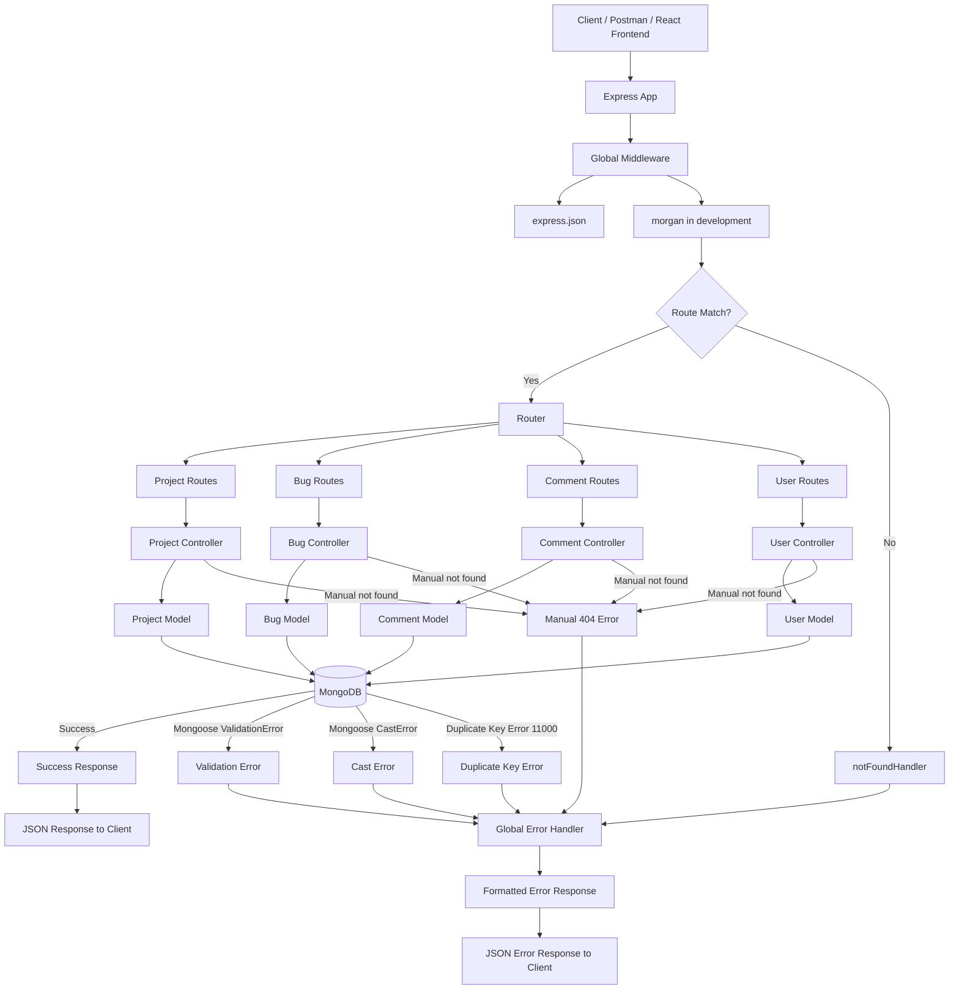

```mermaid
flowchart TD
    A[Client / Postman / React Frontend] --> B[Express App]

    B --> C[Global Middleware]
    C --> C1[express.json]
    C --> C2[morgan in development]

    C2 --> D{Route Match?}

    D -->|Yes| E[Router]
    D -->|No| NF[notFoundHandler]

    E --> PR[Project Routes]
    E --> BR[Bug Routes]
    E --> CR[Comment Routes]
    E --> UR[User Routes]

    PR --> PC[Project Controller]
    BR --> BC[Bug Controller]
    CR --> CC[Comment Controller]
    UR --> UC[User Controller]

    PC --> PM[Project Model]
    BC --> BM[Bug Model]
    CC --> CM[Comment Model]
    UC --> UM[User Model]

    PM --> DB[(MongoDB)]
    BM --> DB
    CM --> DB
    UM --> DB

    DB -->|Success| S[Success Response]
    S --> OUT1[JSON Response to Client]

    DB -->|Mongoose ValidationError| VE[Validation Error]
    DB -->|Mongoose CastError| CE[Cast Error]
    DB -->|Duplicate Key Error 11000| DE[Duplicate Key Error]

    PC -->|Manual not found| MNF[Manual 404 Error]
    BC -->|Manual not found| MNF
    CC -->|Manual not found| MNF
    UC -->|Manual not found| MNF

    NF --> GEH[Global Error Handler]
    VE --> GEH
    CE --> GEH
    DE --> GEH
    MNF --> GEH

    GEH --> FR[Formatted Error Response]
    FR --> OUT2[JSON Error Response to Client]
```
