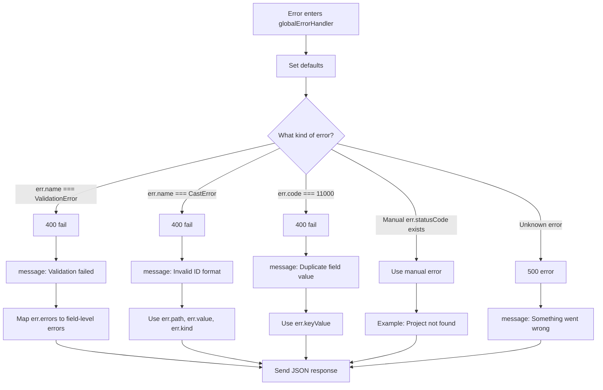

```mermaid
flowchart TD
    A[Error enters globalErrorHandler] --> B[Set defaults]

    B --> C{What kind of error?}

    C -->|err.name === ValidationError| D[400 fail]
    D --> D1[message: Validation failed]
    D1 --> D2[Map err.errors to field-level errors]

    C -->|err.name === CastError| E[400 fail]
    E --> E1[message: Invalid ID format]
    E1 --> E2[Use err.path, err.value, err.kind]

    C -->|err.code === 11000| F[400 fail]
    F --> F1[message: Duplicate field value]
    F1 --> F2[Use err.keyValue]

    C -->|Manual err.statusCode exists| G[Use manual error]
    G --> G1[Example: Project not found]

    C -->|Unknown error| H[500 error]
    H --> H1[message: Something went wrong]

    D2 --> Z[Send JSON response]
    E2 --> Z
    F2 --> Z
    G1 --> Z
    H1 --> Z
```
